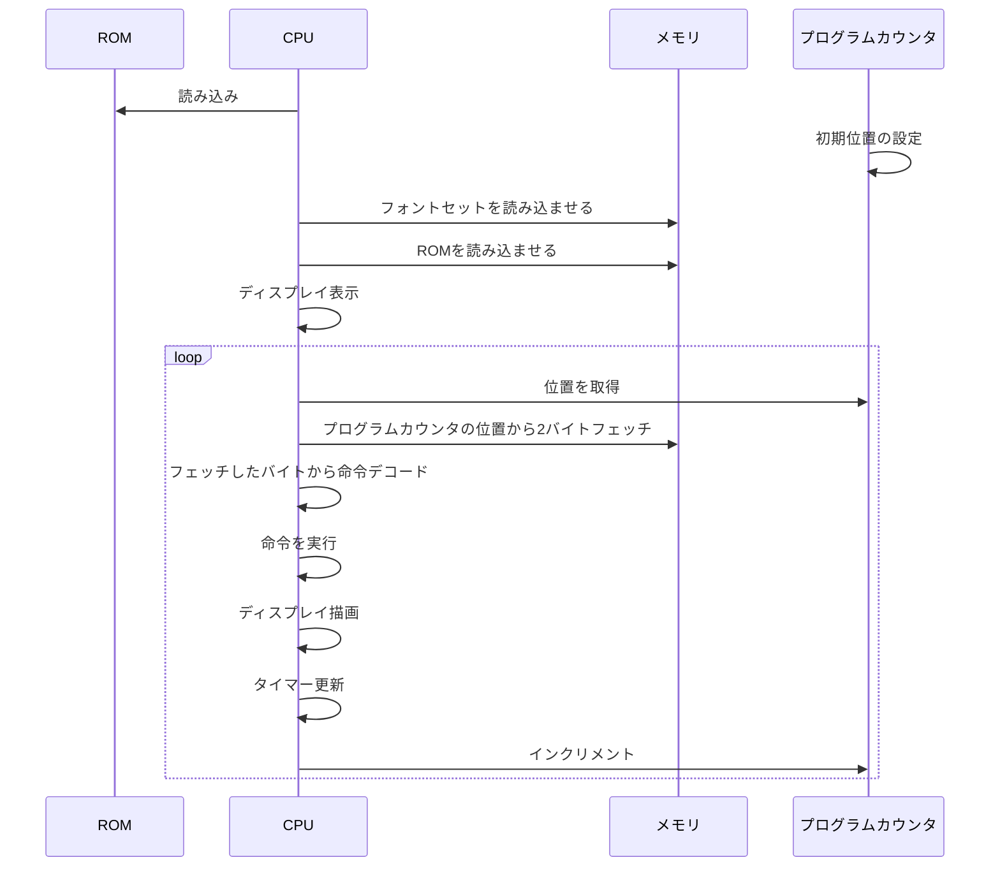

## CHIP-8

chip8（CPUエミュレータ）をTypeScriptで実装してみた。

ブラウザで表示：  
https://hir-247-30.github.io/chip8.ts/

chip8自体の仕様：  
https://yukinarit.github.io/cowgod-chip8-tech-reference-ja/1_about_chip8.html

### 起動

```
npm ci

# CLIでプレイする
# 例えば npm run start BRIX でブロック崩しゲームを開始
npm run start [ROM名]

# ブラウザでプレイする
# コマンド実行後にpublic/index.htmlを開けば動作する
# 注意！ブラウザのCORSを一時的に無効化しておかないと、fetch()が失敗しプレイできない
npm run web
```

### 処理の流れ

