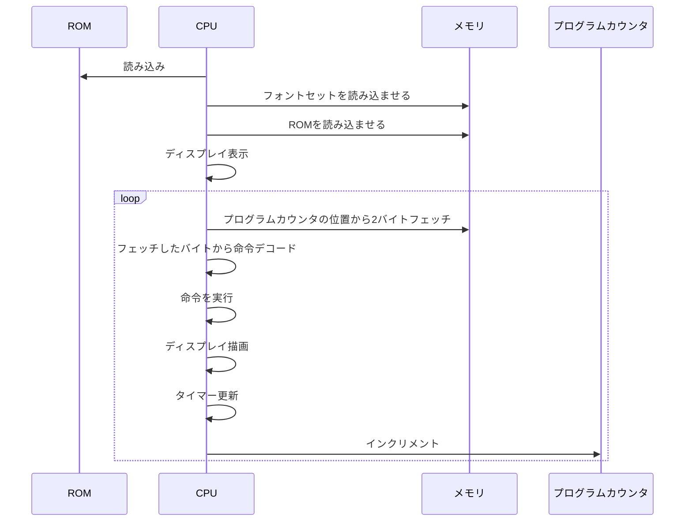

## CHIP-8

chip8（CPUエミュレータ）をTypeScriptで実装してみた。

chip8自体の仕様は下記参照：
https://yukinarit.github.io/cowgod-chip8-tech-reference-ja/1_about_chip8.html

### 起動

```
# 例えば npm run start BRIX でブロック崩しゲームを開始
npm run start [ROM名]
```

### 処理の流れ

